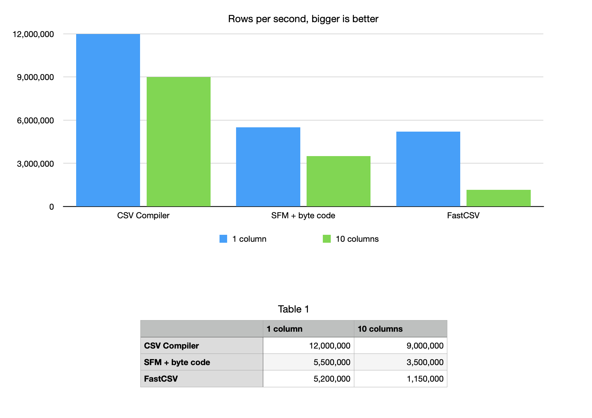

# CSV Compiler

A simple to use efficient java csv marshalling library driven by annotations. Converts a csv source into a
stream of java beans for processing within an application, equivalent to a handwritten marshaller in performance.
The annotation processor generates a CSV marshaller at build time for any class annotated with 
[`@CsvMarshaller`](runtime/src/main/java/com/fluxtion/extension/csvcompiler/annotations/CsvMarshaller.java).

Supported features:

- Simple to use annotations, automatically map CSV to POJO fields
- Fully [RC4180](https://tools.ietf.org/html/rfc4180) compliant csv parser for reading and writing csv
- CSV data pipeline transformations
- Integrates with lombok to reduce boilerplate code
- Override header to property name mapping
- Index or named column support for input files
- JavaBean and fluent accessors/mutators style supported
- Optional field support with default value injection
- Full escaping support for quoted fields
- Missing column support allows partial evaluation
- Comments ignored, configurable
- Empty lines ignored, configurable
- Pluggable custom serializers framework
- Pluggable validation framework
- Pluggable lookup support to convert field values
- Error handling and reporting
- Designed to integrate with java.util.stream.Stream
- Compiles AOT, zero startup cost
- Zero GC field serializers for primitive types and CharSequence
- Array and List support for primitives and Strings 
- Serializers for LocalTime, LocalDate, LocalDateTime
- Re-use marshalled instance or new instance per record
- No external runtime dependencies
- No runtime byte code generation

# Dependencies

- **csv-compiler-processor** an annotation processor that executes at build time to generate a [RowMarshaller](runtime/src/main/java/com/fluxtion/extension/csvcompiler/RowMarshaller.java). 
Not required at runtime, with maven use provided scope or explicitly load as an annotation processor.
- **csv-compiler** a runtime library providing utility function, zerogc utilities and interface definitions

```xml

<dependency>
    <dependency>
        <groupId>com.fluxtion.csv-compiler</groupId>
        <artifactId>csv-compiler</artifactId>
        <version>0.1.18</version>
    </dependency>
    <dependency>
        <groupId>com.fluxtion.csv-compiler</groupId>
        <artifactId>csv-compiler-processor</artifactId>
        <version>0.1.18</version>
        <scope>provided</scope>
    </dependency>
</dependency>
```

# Examples

## CSV data pipeline

This example loads a CSV file transforms it and writes the results to another CSV file. The pipeline demonstrates:

- Extracting a subset of columns from the source data
- Replaces missing values with default values
- Columns are one of, input only, input/output or derived output only
- Header names have spaces
- Rows are filtered from output if they do not meet criteria
- Derived value transforms a textual field to numerical representation
- Derived value transforms a numerical value by an operation
- The output is written to a new file excluding the input only columns

### Data sets

We use the [ames housing from kaggle](https://www.kaggle.com/datasets/godofprogramming/ameshousing) as an input source. The goal is to clean and transform this data set, so 
it can be used in a machine learning model. The source has 82 columns we want to reduce this to a CSV file with a subset 
of columns that only contains valid records.

A sample from the input data set:

| Order | PID        | MS SubClass | MS Zoning | Lot Frontage | Lot Area | Street | Alley | Lot Shape | Land Contour | Utilities | Lot Config | Land Slope | Neighborhood | Condition 1 | Condition 2 | Bldg Type | House Style | Overall Qual | Overall Cond | Year Built | Year Remod/Add | Roof Style | Roof Matl | Exterior 1st | Exterior 2nd | Mas Vnr Type | Mas Vnr Area | Exter Qual | Exter Cond | Foundation | Bsmt Qual | Bsmt Cond | Bsmt Exposure | BsmtFin Type 1 | BsmtFin SF 1 | BsmtFin Type 2 | BsmtFin SF 2 | Bsmt Unf SF | Total Bsmt SF | Heating | Heating QC | Central Air | Electrical | 1st Flr SF | 2nd Flr SF | Low Qual Fin SF | Gr Liv Area | Bsmt Full Bath | Bsmt Half Bath | Full Bath | Half Bath | Bedroom AbvGr | Kitchen AbvGr | Kitchen Qual | TotRms AbvGrd | Functional | Fireplaces | Fireplace Qu | Garage Type | Garage Yr Blt | Garage Finish | Garage Cars | Garage Area | Garage Qual | Garage Cond | Paved Drive | Wood Deck SF | Open Porch SF | Enclosed Porch | 3Ssn Porch | Screen Porch | Pool Area | Pool QC | Fence | Misc Feature | Misc Val | Mo Sold | Yr Sold | Sale Type | Sale Condition | SalePrice |
|:------|:-----------|:------------|:----------|:-------------|:---------|:-------|:------|:----------|:-------------|:----------|:-----------|:-----------|:-------------|:------------|:------------|:----------|:------------|:-------------|:-------------|:-----------|:---------------|:-----------|:----------|:-------------|:-------------|:-------------|:-------------|:-----------|:-----------|:-----------|:----------|:----------|:--------------|:---------------|:-------------|:---------------|:-------------|:------------|:--------------|:--------|:-----------|:------------|:-----------|:-----------|:-----------|:----------------|:------------|:---------------|:---------------|:----------|:----------|:--------------|:--------------|:-------------|:--------------|:-----------|:-----------|:-------------|:------------|:--------------|:--------------|:------------|:------------|:------------|:------------|:------------|:-------------|:--------------|:---------------|:-----------|:-------------|:----------|:--------|:------|:-------------|:---------|:--------|:--------|:----------|:---------------|:----------|
| 1     | 0526301100 | 020         | RL        | 141          | 31770    | Pave   | NA    | IR1       | Lvl          | AllPub    | Corner     | Gtl        | NAmes        | Norm        | Norm        | 1Fam      | 1Story      | 6            | 5            | 1960       | 1960           | Hip        | CompShg   | BrkFace      | Plywood      | Stone        | 112          | TA         | TA         | CBlock     | TA        | Gd        | Gd            | BLQ            | 639          | Unf            | 0            | 441         | 1080          | GasA    | Fa         | Y           | SBrkr      | 1656       | 0          | 0               | 1656        | 1              | 0              | 1         | 0         | 3             | 1             | TA           | 7             | Typ        | 2          | Gd           | Attchd      | 1960          | Fin           | 2           | 528         | TA          | TA          | P           | 210          | 62            | 0              | 0          | 0            | 0         | NA      | NA    | NA           | 0        | 5       | 2010    | WD        | Normal         | 215000    |
| 2     | 0526350040 | 020         | RH        | 80           | 11622    | Pave   | NA    | Reg       | Lvl          | AllPub    | Inside     | Gtl        | NAmes        | Feedr       | Norm        | 1Fam      | 1Story      | 5            | 6            | 1961       | 1961           | Gable      | CompShg   | VinylSd      | VinylSd      | None         | 0            | TA         | TA         | CBlock     | TA        | TA        | No            | Rec            | 468          | LwQ            | 144          | 270         | 882           | GasA    | TA         | Y           | SBrkr      | 896        | 0          | 0               | 896         | 0              | 0              | 1         | 0         | 2             | 1             | TA           | 5             | Typ        | 0          | NA           | Attchd      | 1961          | Unf           | 1           | 730         | TA          | TA          | Y           | 140          | 0             | 0              | 0          | 120          | 0         | NA      | MnPrv | NA           | 0        | 6       | 2010    | WD        | Normal         | 105000    |
| 3     | 0526351010 | 020         | RL        | 81           | 14267    | Pave   | NA    | IR1       | Lvl          | AllPub    | Corner     | Gtl        | NAmes        | Norm        | Norm        | 1Fam      | 1Story      | 6            | 6            | 1958       | 1958           | Hip        | CompShg   | Wd Sdng      | Wd Sdng      | BrkFace      | 108          | TA         | TA         | CBlock     | TA        | TA        | No            | ALQ            | 923          | Unf            | 0            | 406         | 1329          | GasA    | TA         | Y           | SBrkr      | 1329       | 0          | 0               | 1329        | 0              | 0              | 1         | 1         | 3             | 1             | Gd           | 6             | Typ        | 0          | NA           | Attchd      | 1958          | Unf           | 1           | 312         | TA          | TA          | Y           | 393          | 36            | 0              | 0          | 0            | 0         | NA      | NA    | Gar2         | 12500    | 6       | 2010    | WD        | Normal         | 172000    |
| 4     | 0526353030 | 020         | RL        | 93           | 11160    | Pave   | NA    | Reg       | Lvl          | AllPub    | Corner     | Gtl        | NAmes        | Norm        | Norm        | 1Fam      | 1Story      | 7            | 5            | 1968       | 1968           | Hip        | CompShg   | BrkFace      | BrkFace      | None         | 0            | Gd         | TA         | CBlock     | TA        | TA        | No            | ALQ            | 1065         | Unf            | 0            | 1045        | 2110          | GasA    | Ex         | Y           | SBrkr      | 2110       | 0          | 0               | 2110        | 1              | 0              | 2         | 1         | 3             | 1             | Ex           | 8             | Typ        | 2          | TA           | Attchd      | 1968          | Fin           | 2           | 522         | TA          | TA          | Y           | 0            | 0             | 0              | 0          | 0            | 0         | NA      | NA    | NA           | 0        | 4       | 2010    | WD        | Normal         | 244000    |
| 5     | 0527105010 | 060         | RL        | 74           | 13830    | Pave   | NA    | IR1       | Lvl          | AllPub    | Inside     | Gtl        | Gilbert      | Norm        | Norm        | 1Fam      | 2Story      | 5            | 5            | 1997       | 1998           | Gable      | CompShg   | VinylSd      | VinylSd      | None         | 0            | TA         | TA         | PConc      | Gd        | TA        | No            | GLQ            | 791          | Unf            | 0            | 137         | 928           | GasA    | Gd         | Y           | SBrkr      | 928        | 701        | 0               | 1629        | 0              | 0              | 2         | 1         | 3             | 1             | TA           | 6             | Typ        | 1          | TA           | Attchd      | 1997          | Fin           | 2           | 482         | TA          | TA          | Y           | 212          | 34            | 0              | 0          | 0            | 0         | NA      | MnPrv | NA           | 0        | 3       | 2010    | WD        | Normal         | 189900    |
| 6     | 0527105030 | 060         | RL        | 78           | 9978     | Pave   | NA    | IR1       | Lvl          | AllPub    | Inside     | Gtl        | Gilbert      | Norm        | Norm        | 1Fam      | 2Story      | 6            | 6            | 1998       | 1998           | Gable      | CompShg   | VinylSd      | VinylSd      | BrkFace      | 20           | TA         | TA         | PConc      | TA        | TA        | No            | GLQ            | 602          | Unf            | 0            | 324         | 926           | GasA    | Ex         | Y           | SBrkr      | 926        | 678        | 0               | 1604        | 0              | 0              | 2         | 1         | 3             | 1             | Gd           | 7             | Typ        | 1          | Gd           | Attchd      | 1998          | Fin           | 2           | 470         | TA          | TA          | Y           | 360          | 36            | 0              | 0          | 0            | 0         | NA      | NA    | NA           | 0        | 6       | 2010    | WD        | Normal         | 195500    |
| 7     | 0527127150 | 120         | RL        | 41           | 4920     | Pave   | NA    | Reg       | Lvl          | AllPub    | Inside     | Gtl        | StoneBr      | Norm        | Norm        | TwnhsE    | 1Story      | 8            | 5            | 2001       | 2001           | Gable      | CompShg   | CemntBd      | CmentBd      | None         | 0            | Gd         | TA         | PConc      | Gd        | TA        | Mn            | GLQ            | 616          | Unf            | 0            | 722         | 1338          | GasA    | Ex         | Y           | SBrkr      | 1338       | 0          | 0               | 1338        | 1              | 0              | 2         | 0         | 2             | 1             | Gd           | 6             | Typ        | 0          | NA           | Attchd      | 2001          | Fin           | 2           | 582         | TA          | TA          | Y           | 0            | 0             | 170            | 0          | 0            | 0         | NA      | NA    | NA           | 0        | 4       | 2010    | WD        | Normal         | 213500    |
| 8     | 0527145080 | 120         | RL        | 43           | 5005     | Pave   | NA    | IR1       | HLS          | AllPub    | Inside     | Gtl        | StoneBr      | Norm        | Norm        | TwnhsE    | 1Story      | 8            | 5            | 1992       | 1992           | Gable      | CompShg   | HdBoard      | HdBoard      | None         | 0            | Gd         | TA         | PConc      | Gd        | TA        | No            | ALQ            | 263          | Unf            | 0            | 1017        | 1280          | GasA    | Ex         | Y           | SBrkr      | 1280       | 0          | 0               | 1280        | 0              | 0              | 2         | 0         | 2             | 1             | Gd           | 5             | Typ        | 0          | NA           | Attchd      | 1992          | RFn           | 2           | 506         | TA          | TA          | Y           | 0            | 82            | 0              | 0          | 144          | 0         | NA      | NA    | NA           | 0        | 1       | 2010    | WD        | Normal         | 191500    |
| 9     | 0527146030 | 120         | RL        | 39           | 5389     | Pave   | NA    | IR1       | Lvl          | AllPub    | Inside     | Gtl        | StoneBr      | Norm        | Norm        | TwnhsE    | 1Story      | 8            | 5            | 1995       | 1996           | Gable      | CompShg   | CemntBd      | CmentBd      | None         | 0            | Gd         | TA         | PConc      | Gd        | TA        | No            | GLQ            | 1180         | Unf            | 0            | 415         | 1595          | GasA    | Ex         | Y           | SBrkr      | 1616       | 0          | 0               | 1616        | 1              | 0              | 2         | 0         | 2             | 1             | Gd           | 5             | Typ        | 1          | TA           | Attchd      | 1995          | RFn           | 2           | 608         | TA          | TA          | Y           | 237          | 152           | 0              | 0          | 0            | 0         | NA      | NA    | NA           | 0        | 3       | 2010    | WD        | Normal         | 236500    |
| 10    | 0527162130 | 060         | RL        | 60           | 7500     | Pave   | NA    | Reg       | Lvl          | AllPub    | Inside     | Gtl        | Gilbert      | Norm        | Norm        | 1Fam      | 2Story      | 7            | 5            | 1999       | 1999           | Gable      | CompShg   | VinylSd      | VinylSd      | None         | 0            | TA         | TA         | PConc      | TA        | TA        | No            | Unf            | 0            | Unf            | 0            | 994         | 994           | GasA    | Gd         | Y           | SBrkr      | 1028       | 776        | 0               | 1804        | 0              | 0              | 2         | 1         | 3             | 1             | Gd           | 7             | Typ        | 1          | TA           | Attchd      | 1999          | Fin           | 2           | 442         | TA          | TA          | Y           | 140          | 60            | 0              | 0          | 0            | 0         | NA      | NA    | NA           | 0        | 6       | 2010    | WD        | Normal         | 189000    |

The post processed output data set should have:

- a subset of the input columns
- replace missing values such as Lot frontage with a default value.
- calculate the Lot frontage squared
- remove Lot frontage field from the output
- convert MS Zoning from a text value to a numerical value stored in ms_zone_category field
- remove MS Zoning field from the output
- use fluent accessors to mirror property names, no get/set
- filter rows from the output with missing Lot frontage
- filter rows from the output that are not in a defined MS Zoning category set

A sample output that should be generated

| PID       | MS\_SubClass | Lot\_Frontage\_Squared | ms\_zone\_category |
|:----------|:-------------|:-----------------------|:-------------------|
| 526301100 | 20           | 19881                  | 3                  |
| 526351010 | 20           | 6561                   | 3                  |
| 526353030 | 20           | 8649                   | 3                  |
| 527105010 | 60           | 5476                   | 3                  |
| 527105030 | 60           | 6084                   | 3                  |
| 527127150 | 120          | 1681                   | 3                  |
| 527145080 | 120          | 1849                   | 3                  |
| 527146030 | 120          | 1521                   | 3                  |
| 527162130 | 60           | 3600                   | 3                  |
| 527163010 | 60           | 5625                   | 3                  |

Solving this problem requires two steps; firstly annotate a POJO's fields
with [`@CsvMarshaller`](runtime/src/main/java/com/fluxtion/extension/csvcompiler/annotations/CsvMarshaller.java),
secondly use the utility
method [`RowMarshaller.transform()`](runtime/src/main/java/com/fluxtion/extension/csvcompiler/RowMarshaller.java#L159).

The transform function performs the following operations, loads the input file from the supplied path, transforms/filters records with a
java.util.stream.Stream provided by the user and then finally writes records to an output file from the supplied path.

### Csv record file

The [HouseSaleRecord.java](example/src/main/java/com/fluxtion/extension/csvcompiler/example/HouseSaleRecord.java) class
represents
the mapping of input, output and derived fields using annotations.
The [`@CsvMarshaller`](runtime/src/main/java/com/fluxtion/extension/csvcompiler/annotations/CsvMarshaller.java)
annotation is used in conjunction with lombok to generate a POJO that has fluent accessors, removing the need for
boilerplate code. The [RowMarshaller](runtime/src/main/java/com/fluxtion/extension/csvcompiler/RowMarshaller.java) for
HouseSaleRecord is generated at compile time by the csv-compiler annotation processor.

```java

@Data
@CsvMarshaller(fluent = true)
@Accessors(fluent = true)
public class HouseSaleRecord {
    //input only
    @ColumnMapping(outputField = false)
    private int Order;
    @ColumnMapping(outputField = false, columnName = "Lot Frontage", defaultValue = "-1")
    private int Lot_Frontage;
    @ColumnMapping(outputField = false, columnName = "MS Zoning")
    private String MS_Zoning;

    //input and output
    private int PID;
    @ColumnMapping(columnName = "MS SubClass")
    private int MS_SubClass;

    //derived no inputs
    @ColumnMapping(optionalField = true)
    private int Lot_Frontage_Squared;
    @ColumnMapping(optionalField = true)
    private int ms_zone_category;
}
```

- Input only fields are annotated with ```@ColumnMapping(outputField = false)```
- Input column names are mapped with ```@ColumnMapping(columnName = "MS SubClass")```
- Output only derived fields are annotated with ```@ColumnMapping(optionalField = true)```
- Annotation free properties are both input and output fields
- Default values are marked with ``` @ColumnMapping(defaultValue = "-1")```
- Annotations can be
  combined - ```@ColumnMapping(outputField = false, columnName = "Lot Frontage", defaultValue = "-1")```

### CSV data pipeline

The  [AmesHousingCsvPipeline.java](example/src/main/java/com/fluxtion/extension/csvcompiler/example/AmesHousingCsvPipeline.java)
creates a csv data pipeline using the utility function from the 
[`RowMarshaller.transform()`](runtime/src/main/java/com/fluxtion/extension/csvcompiler/RowMarshaller.java#L159) class

```java
public class AmesHousingCsvPipeline {

    @SneakyThrows
    public static void main(String[] args) {
        RowMarshaller.load(HouseSaleRecord.class).transform(
                Path.of("data/AmesHousing.csv"),
                Path.of("data/PostProcess.csv"),
                s -> s.filter(record -> record.Lot_Frontage() > 0)
                        .map(AmesHousingCsvPipeline::squareLotFrontage)
                        .map(AmesHousingCsvPipeline::ms_zone_to_category)
                        .filter(record -> record.ms_zone_category() > 0));
    }

    public static HouseSaleRecord squareLotFrontage(HouseSaleRecord houseSaleRecord) {
        int lotFrontage = houseSaleRecord.Lot_Frontage();
        houseSaleRecord.Lot_Frontage_Squared(lotFrontage * lotFrontage);
        return houseSaleRecord;
    }

    public static HouseSaleRecord ms_zone_to_category(HouseSaleRecord houseSaleRecord) {
        switch (houseSaleRecord.MS_Zoning()) {
            case "A" -> houseSaleRecord.ms_zone_category(1);
            case "FV" -> houseSaleRecord.ms_zone_category(2);
            case "RL" -> houseSaleRecord.ms_zone_category(3);
            case "RM" -> houseSaleRecord.ms_zone_category(4);
            default -> houseSaleRecord.ms_zone_category(-1);
        }
        return houseSaleRecord;
    }
}
```

## CSV to stream of bean instances

This example converts String -> csv -> bean -> java.util.stream.Stream for processing, any validation errors are printed to 
console. The example is here [StreamBeans.java](example/src/main/java/com/fluxtion/extension/csvcompiler/example1/StreamBeans.java)

### StreamBeans code

Mark a java bean with annotation `@CSVMarshaller` use lombok `@Data` to remove the boilerplate getter/setter
methods. The [RowMarshaller](runtime/src/main/java/com/fluxtion/extension/csvcompiler/RowMarshaller.java) is generated 
at compile time by the csv-compiler annotation processor.

```java

@Data
@CsvMarshaller
public class Person {
    private String name;
    private int age;
}
```

The `RowMarshaller.load(Person.class)` loads the RowMarshaller for the Person javaBean. 

To set the validation logger use `.setValidationLogger(ValidationLogger.CONSOLE)`, in this case directs validation messages  to the console. 

A string is supplied as input to the marshaller to create a stream of Person instances with 
`.stream("name,age\n" + ....`. The stream method returns a java.util.stream.Stream for downstream processing. 

Processing logic is added to the returned stream as per standard java `.peek(System.out::println) ....`

```java
public class StreamBeans {
    public static void main(String[] args) {
        RowMarshaller.load(Person.class)
                .setValidationLogger(ValidationLogger.CONSOLE)
                .stream("name,age\n" +
                        "Linda Smith,43\n" +
                        "Soren Miller,33\n" +
                        "fred,not a number\n")
                .peek(System.out::println)
                .mapToInt(Person::getAge)
                .max()
                .ifPresent(i -> System.out.println("\nRESULT - Max age:" + i));
    }
}
```

Application execution output:

```text
Main.Person(name=Linda Smith, age=43)
Main.Person(name=Soren Miller, age=33)
Person problem pushing 'not a number' from row:'4' fieldIndex:'1' targetMethod:'Person#setAge' error:'java.lang.NumberFormatException: For input string: "not a number"'
Max age:43
```

# Steps to process a CSV source
Required steps to set up a successful processing pipeline:

1. Add CVS compiler dependencies to you project.
2. Create a java bean with getters and setter for persistent properties
3. Add a `@CSVMarshaller` annotation to the java bean source file
4. Load marshaller using `RowMarshaller.load([Bean.class])`
5. Stream from a reader or a String into the loaded RowMarshaller, add stream logic to process marshalled instances
   `.stream([Reader|String])`

Behaviour can optionally be injected into the processing chain:

1. Register a validation logger to record marshalling errors. `RowMarshaller.setValidationLogger`
2. Register a row validator with `RowMarshaller.setRowValidator`
3. Register a fatal exception handler for parse errors with `RowMarshaller.setFatalExceptionHandler`
4. Register a header transformer with `RowMarshaller.setHeaderTransformer`
5. Register a lookup function with `RowMarshaller.addLookup`

# Performance

The CSV compiler annotation processor generates a marshaller during compilation. When deployed as a stateless function
in the cloud the only cpu cycles billed are used to parse the data. For smaller documents CSV compiler can
finish well before interpreting parsers have completed. Combined with Graal native results in
low startup times as marshalling code is statically compiled AOT.

## Example for calculating a sum of doubles in a column. Single column and 10 Columns



10 column version, 9 columns are ignored.

The parser itself employs several optimisations at runtime:

- Can operate as a zerogc source, re-using the target bean as a flyweight
- Converts primitives in a zerogc manner
- Highly optimised number parsers
- Native support of CharSequence, reusing buffers
- Zero cost abstraction only generating features if specified in annotations
- Skips columns if they are not required in the target bean
- Reduced internal conditional execution to aid branch prediction

If reducing costs and energy consumption are important to you please consider using or help improve CVS compiler.


